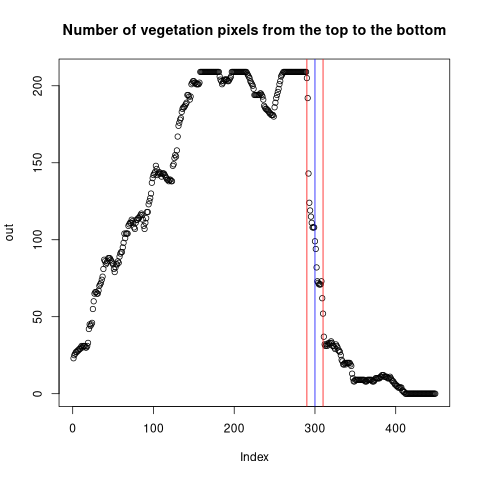

#### Test result with the sample data captured in front of the University.

##### Test procedure
1. Prepare street tree pictures 
2. Performing semantic segmentation (a. overlaid with original picture, b. only classified one)
3. Analyze result picture (see CroppedImageAnalysis.r)

##### Extract biometrics of the tree
1. Use semantic segmentation data and bounding box from YOLO.
2. Crop area for each bounding box.
3. After cropping individual tree, calculate the number of vegetation pixels from the top to the bottom (convert 0 to NA)
    * 
    * The maximum number of pixels for a row is the width of the crown.
    * The point that the number of pixels changed suddenly can be a point of the height below crown.
    * The median value of the numbers for each row below sudden changing point can be a DBH.
    * The height of the tree can be a number of columns that have vegetation pixels.
4. Equation
    * Focal length (Not the real focal length) = (Distance x Pixels) / Width (or Height)
    * If we know the distance and focal length,
    * W = D x P / F

